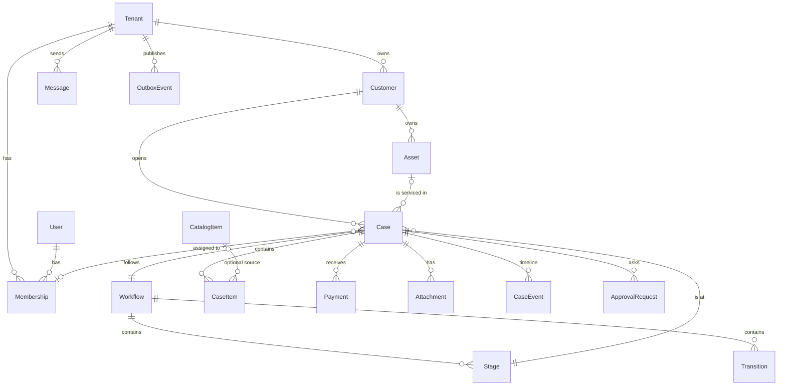
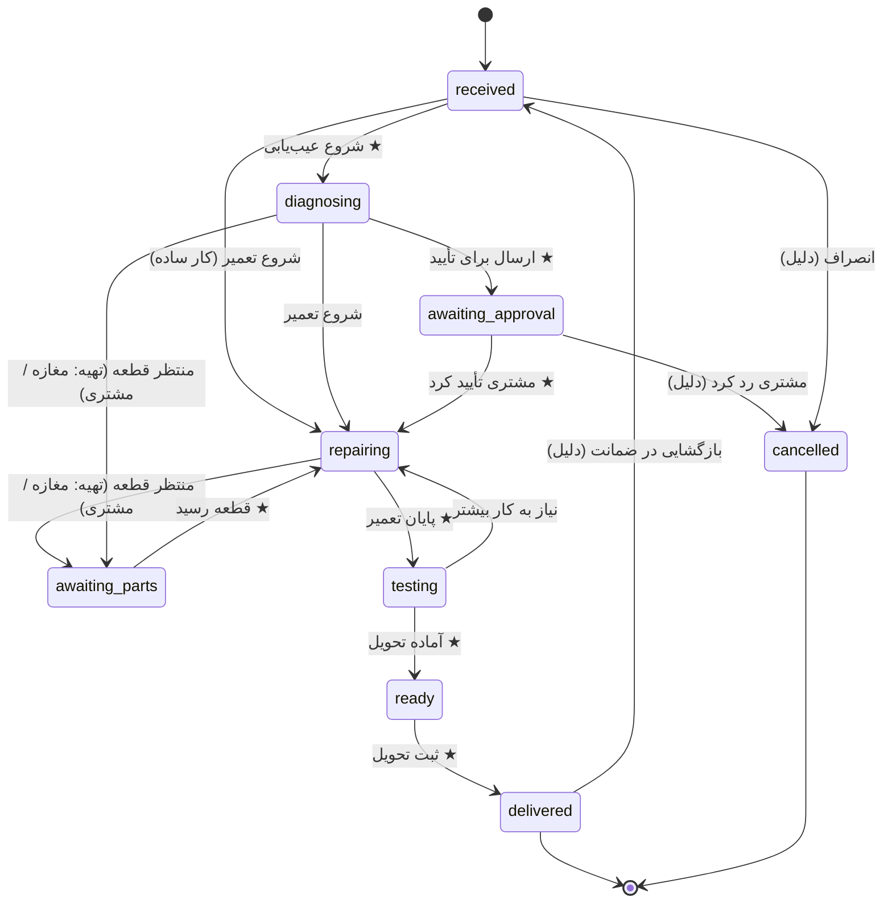

# 03 — Domain Model

اصل: **هسته صنفی نیست.** هر چیزی که مخصوص موتورسازی است، یا در Template است یا در فیلدهای سفارشی Asset.

## 1. نمای کلی

همه جدول‌ها (به جز `User`) ستون `TenantId` دارند.

## 2. موجودیت‌ها

### Tenant (کسب‌وکار)
`Id, Name, Slug, Vertical (motorcycle_repair), Phone, Address, TimeZone (Asia/Tehran), CreatedAt`

### User / Membership
- `User`: `Id, Mobile (unique), DisplayName` — ورود با OTP موبایل.
- `Membership`: `TenantId, UserId, Role, Permissions (text[]), IsActive`
- یک User می‌تواند عضو چند Tenant باشد.

**نقش واقعی در موتورسازی:** استاد خودش پرونده ثبت می‌کند، یا به یکی از شاگردها دسترسی «مدیر داخلی»
می‌دهد که پرونده ثبت و به بقیه شاگردها تخصیص بدهد. پس دسترسی باید **per نفر قابل دادن** باشد، نه فقط نقش ثابت.

| Role (پیش‌تنظیم) | کیست | Permissionهای پیش‌فرض |
|------------------|------|----------------------|
| `owner` | استاد / صاحب مغازه | همه |
| `supervisor` | شاگرد ارشد (مدیر داخلی) | `cases.create`, `cases.assign`, `cases.view_all`, `cases.work` |
| `technician` | شاگرد | `cases.work` (فقط پرونده‌های تخصیص‌یافته به خودش) |

Permissionها: `cases.create`, `cases.assign`, `cases.view_all`, `cases.work`, `payments.record`,
`reports.view`, `staff.manage`, `settings.manage`.
Role فقط مقدار اولیه را می‌دهد؛ استاد می‌تواند per نفر یک Permission را روشن/خاموش کند
(مثلاً به شاگرد ارشد `payments.record` بدهد یا ندهد، چون پول حساس است).

### Customer
`Id, TenantId, Mobile, FullName, Notes, CreatedAt`
- `(TenantId, Mobile)` یکتا. جستجو با ۴ رقم آخر موبایل هم کار کند.

### Asset (وسیله)
`Id, TenantId, CustomerId, Kind (motorcycle | ...), Title, Identifier, Attributes (jsonb), CreatedAt`
- `Title`: «Honda CG 125»، `Identifier`: پلاک یا شماره موتور.
- `Attributes` برای فیلدهای صنفی: `{ "brand": "Honda", "model": "CG125", "year": 1398, "color": "قرمز", "engineNo": "..." }`.
- کیلومتر **روی Case** ثبت می‌شود (`OdometerKm`) چون در هر مراجعه فرق دارد.
- Asset اختیاری است؛ هسته باید بدون آن هم کار کند.

### Workflow / Stage / Transition
- `Workflow`: `Id, TenantId, Name, IsDefault, SourceTemplateKey`
- `Stage`: `Id, WorkflowId, Key, Name, Color, Order, Category, IsActive`
  - `Category`: `open | waiting | active | done | cancelled` — گزارش‌ها و داشبورد روی Category کار می‌کنند، نه نام Stage. این همان چیزی است که اجازه می‌دهد هر کسب‌وکار نام‌ها را عوض کند بدون اینکه داشبورد خراب شود.
- `Transition`: `Id, WorkflowId, FromStageId, ToStageId, Label, IsPrimary, RequiresReason, AllowedRoles (text[])`
  - `IsPrimary`: دکمه «اقدام بعدی» در صفحه پرونده (اصل UX «محتمل‌ترین کار بعدی»).
- **Template** فایل JSON داخل کد است؛ هنگام Onboarding روی Tenant کپی می‌شود. تغییر Template بعداً روی Tenantهای موجود اثر ندارد.

### Case (پرونده)
`Id, TenantId, Number (ترتیبی per tenant), CustomerId, AssetId?, WorkflowId, StageId, AssigneeId?,
Request (شرح مشکل), Diagnosis, OdometerKm?, EstimatedAmount?, PromisedAt?,
OpenedAt, ClosedAt?, StageEnteredAt, Version`
- `StageEnteredAt` برای «گیرکرده» (مثلاً بیش از ۲ روز در `waiting`).
- `Version` برای Optimistic Concurrency (دو نفر هم‌زمان Stage عوض نکنند).

### CaseItem (Line Item)
`Id, CaseId, Kind (product | service | labor), CatalogItemId?, Title, Quantity, UnitPriceRials (فروش),
UnitCostRials? (خرید), Discount, Supplier (shop | customer), Status (needed | used), PerformedBy?, AddedBy, AddedAt`
- سود هر ردیف = `(UnitPrice − UnitCost) × Quantity`. قیمت خرید فقط برای مالک / `reports.view` نمایش داده می‌شود؛
  در فاکتور مشتری و صفحه شاگرد هرگز نمی‌آید.
- **عنوان آزاد بدون کاتالوگ مجاز است** (قطعه‌ای که همان لحظه از بازار خریده شد).
- مبالغ: `bigint` به **ریال**. نمایش به تومان در UI.

**قطعه‌ای که مشتری خودش می‌خرد** (`Supplier = customer`):
- در فاکتور با مبلغ صفر و برچسب «قطعه مشتری» نمایش داده می‌شود، ولی **در سابقه موتور ثبت می‌شود**
  (دفعه بعد معلوم است چه قطعه‌ای و کی عوض شده).
- اجرت نصب آن یک `labor` جداست.
- برای بحث ضمانت مهم است: قطعه مشتری از ضمانت مغازه خارج است و این در Timeline و فاکتور دیده می‌شود.

**لیست قطعه‌های لازم** (`Status = needed`):
- حین عیب‌یابی، قطعه‌ها با وضعیت «لازم» ثبت می‌شوند و برای هر کدام مشخص می‌شود چه کسی تهیه می‌کند.
- اگر تهیه با مشتری است → با رفتن به `awaiting_parts` لیست قطعه‌ها با SMS برای مشتری می‌رود.
- وقتی قطعه رسید/نصب شد → `used`. فقط `used`ها در مبلغ نهایی حساب می‌شوند.

`PerformedBy` روی `labor`: چه شاگردی این کار را انجام داد (پایه گزارش کارکرد و دستمزد درصدی شاگرد در آینده).

### کار شاگرد و دستمزد
- **کسی که کار به او تخصیص دارد، خودش «پایان تعمیر» را می‌زند**؛ استاد ممکن است اصلاً در مغازه نباشد.
  Transitionهای کاری (`repairing → testing`، `awaiting_parts → repairing`، …) برای `cases.work` روی پرونده‌های خودش مجاز است.
- `Membership.PayModel`: `fixed | commission | mixed`، `CommissionPercent?`، `FixedMonthly?`.
- کارکرد شاگرد = `Σ labor` با `PerformedBy` او در بازه؛ پورسانت = کارکرد × درصد. (گزارش در S5؛ مدل از S1.)

### ارتباط پرونده‌ها: بازگشایی، برگشتی، ادغام
- **بازگشایی:** پرونده `delivered` در بازه ضمانت دوباره باز می‌شود (Transition `delivered → received` با دلیل
  اجباری، فقط `cases.create`). Event `case.reopened`.
- **پرونده برگشتی:** اگر پرونده جدید باز شد، می‌تواند `ParentCaseId` بگیرد (`Relation = comeback`).
  هنگام ثبت پرونده برای موتوری که در ۳۰ روز گذشته پرونده داشته، سیستم می‌پرسد «برگشتی پرونده #۱۰۲۴ است؟».
- **ادغام (Merge):** پرونده B در پرونده A ادغام می‌شود: Itemها، Paymentها، Attachmentها و Timeline به A
  منتقل می‌شوند، B با `MergedIntoCaseId = A` بسته و فقط‌خواندنی می‌شود (حذف نمی‌شود). شرط: همان مشتری، و B هنوز تحویل نشده.
  Event `case.merged` روی هر دو. فقط `cases.create`.

### ضمانت (Warranty)
`CaseItem.WarrantyDays?` و `Case.WarrantyUntil` (= تحویل + بیشترین WarrantyDays اجرت/قطعه مغازه).
- قطعه مشتری هرگز ضمانت ندارد.
- پرونده برگشتی در بازه ضمانت → اجرت‌ها پیش‌فرض با برچسب «ضمانتی» و مبلغ صفر.
- فاکتور، تاریخ پایان ضمانت را نشان می‌دهد.

### نسیه (حساب مشتری)
- مانده پرونده‌های تحویل‌شده = بدهی مشتری. `Customer.Balance` محاسبه‌ای از همه پرونده‌ها.
- `Case.DueDate?` (سررسید قول‌داده‌شده) + لیست «نسیه‌ها» با مرتب‌سازی بر اساس سررسید/مبلغ.
- پرداخت بعدی می‌تواند به پرونده قدیمی ثبت شود. SMS یادآوری بدهی (الگو `customer.debt_reminder`)، دستی در MVP.
- هنگام ثبت پرونده جدید برای مشتری بدهکار، هشدار نمایش داده می‌شود.

### نگهداشت موتور (Custody)
- `Case.CustodyStatus`: `in_shop | with_customer` و `CheckedInAt / CheckedOutAt`. موتوری که «آماده تحویل» است
  ولی هنوز در مغازه است در داشبورد دیده می‌شود.
- **قبض پذیرش:** هنگام پذیرش، وضعیت ظاهری، کیلومتر، لوازم همراه (کلاه، سوئیچ، مدارک)، و عکس‌ها ثبت می‌شود
  (`IntakeChecklist jsonb`) و لینک قبض برای مشتری می‌رود؛ همین سند در تحویل استفاده می‌شود.
- `StorageFeePerDay?` در تنظیمات (اختیاری): اگر موتور N روز بعد از «آماده تحویل» تحویل گرفته نشد، هزینه انبارداری
  پیشنهاد می‌شود (به‌صورت Item، با تأیید کاربر).

### CatalogItem
`Id, TenantId, Kind, Title, DefaultPrice, IsActive` (موجودی/انبار خارج از MVP)

### Payment
`Id, CaseId, Amount, Method (cash | card | transfer | other), PaidAt, RecordedBy, Note`
- مانده = `Σ CaseItem(used) − Σ Payment` (محاسبه‌ای، ذخیره نمی‌شود).
- پرداخت قبل از تحویل مجاز است (**بیعانه** برای خرید قطعه توسط مغازه)؛ مانده می‌تواند موقتاً منفی باشد (بستانکاری مشتری).

### Attachment
`Id, CaseId, Kind (photo | file), StorageKey, ContentType, SizeBytes, CreatedBy, CreatedAt`

### ApprovalRequest (تأیید مشتری)
`Id, CaseId, Amount, Description, Token (یک‌بار مصرف), Status (pending | approved | rejected | expired), SentAt, RespondedAt`
- لینک کوتاه در SMS → صفحه عمومی ساده با دو دکمه.

### CaseEvent (Timeline)
`Id, CaseId, TenantId, Type, ActorId?, OccurredAt, Data (jsonb)`
- **Append-only.** هیچ‌وقت ویرایش یا حذف نمی‌شود.
- Stage = «الان کجاست»، CaseItem = «چه کاری/قطعه‌ای»، CaseEvent = «چه اتفاقی افتاد».

### Message (ارتباط)
جزئیات در [04-sms-design](04-sms-design.md).

### OutboxEvent
جزئیات در [05-integrations](05-integrations.md).

## 3. Template پیش‌فرض: موتورسازی (`motorcycle_repair`)

> نسخه اولیه بر اساس فرض. **بعد از Discovery بازبینی شود.**

| Key | نام | Category | رنگ |
|-----|-----|----------|-----|
| `received` | پذیرش شد | open | خاکستری |
| `diagnosing` | در حال عیب‌یابی | active | آبی |
| `awaiting_approval` | منتظر تأیید مشتری | waiting | نارنجی |
| `awaiting_parts` | منتظر قطعه | waiting | نارنجی |
| `repairing` | در حال تعمیر | active | آبی |
| `testing` | تست | active | آبی |
| `ready` | آماده تحویل | done | سبز |
| `delivered` | تحویل شد | done (terminal) | سبز تیره |
| `cancelled` | انصراف | cancelled (terminal) | قرمز |

★ = `IsPrimary` (دکمه اقدام بعدی).

**قانون‌های ثابت MVP** (در کد، نه Rule Engine):
- ورود به `delivered` اگر مانده > ۰ باشد → هشدار و ثبت «نسیه» به‌عنوان Event (مسدود نمی‌کند).
- Transition با `RequiresReason` بدون دلیل ثبت نمی‌شود.
- ورود به Stage با Category=`done` → `ClosedAt` ست می‌شود.

## 4. کاتالوگ Eventها

نام‌ها پایدار هستند چون به API بیرونی هم می‌روند.

| Event | Data |
|-------|------|
| `customer.created` | customerId, mobile, fullName |
| `case.opened` | caseId, number, customerId, assetId, request |
| `case.stage_changed` | caseId, fromStage, toStage, category, reason? |
| `case.assigned` | caseId, assigneeId |
| `case.item_added` / `case.item_removed` | caseId, item |
| `case.approval_requested` / `case.approval_responded` | caseId, amount, status |
| `case.attachment_added` | caseId, attachmentId |
| `case.note_added` | caseId, text |
| `payment.recorded` | caseId, amount, method, balanceAfter |
| `case.delivered` | caseId, customerId, assetId, total, paid, balance, odometerKm |
| `case.cancelled` | caseId, reason |
| `case.reopened` | caseId, reason |
| `case.merged` | sourceCaseId, targetCaseId |
| `case.custody_changed` | caseId, custodyStatus |
| `message.sent` / `message.failed` | messageId, caseId?, template |

## Future: brands and branches (decided ۱۴۰۵/۰۷/۱۷, not built)
`Tenant` is **one branch** and remains the isolation boundary. Later an `Organization` (owner account) holds
`Brand`s, each with branches (= tenants); owner membership at organization level sees all branches.
Do not add code that assumes one owner has exactly one shop. See `docs/09-roadmap-signup-license-admin.md`.
