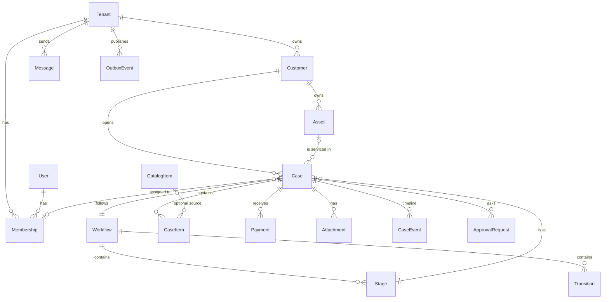
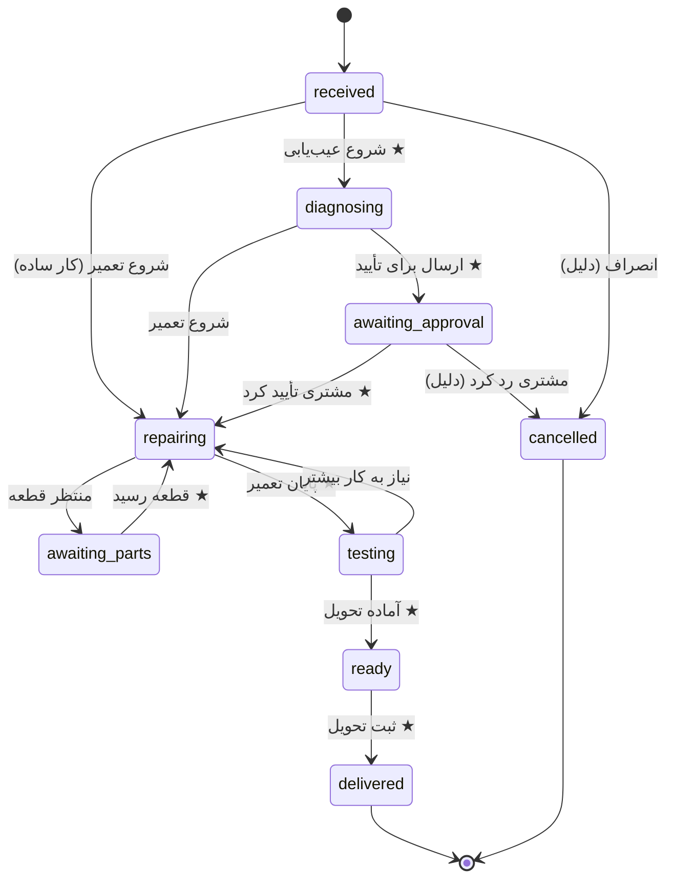

# 03 — Domain Model

اصل: **هسته صنفی نیست.** هر چیزی که مخصوص موتورسازی است، یا در Template است یا در فیلدهای سفارشی Asset.

## 1. نمای کلی

همه جدول‌ها (به جز `User`) ستون `TenantId` دارند.

## 2. موجودیت‌ها

### Tenant (کسب‌وکار)
`Id, Name, Slug, Vertical (motorcycle_repair), Phone, Address, TimeZone (Asia/Tehran), CreatedAt`

### User / Membership
- `User`: `Id, Mobile (unique), DisplayName` — ورود با OTP موبایل.
- `Membership`: `TenantId, UserId, Role (owner | manager | reception | technician), IsActive`
- یک User می‌تواند عضو چند Tenant باشد.

### Customer
`Id, TenantId, Mobile, FullName, Notes, CreatedAt`
- `(TenantId, Mobile)` یکتا. جستجو با ۴ رقم آخر موبایل هم کار کند.

### Asset (وسیله)
`Id, TenantId, CustomerId, Kind (motorcycle | ...), Title, Identifier, Attributes (jsonb), CreatedAt`
- `Title`: «Honda CG 125»، `Identifier`: پلاک یا شماره موتور.
- `Attributes` برای فیلدهای صنفی: `{ "brand": "Honda", "model": "CG125", "year": 1398, "color": "قرمز", "engineNo": "..." }`.
- کیلومتر **روی Case** ثبت می‌شود (`OdometerKm`) چون در هر مراجعه فرق دارد.
- Asset اختیاری است؛ هسته باید بدون آن هم کار کند.

### Workflow / Stage / Transition
- `Workflow`: `Id, TenantId, Name, IsDefault, SourceTemplateKey`
- `Stage`: `Id, WorkflowId, Key, Name, Color, Order, Category, IsActive`
  - `Category`: `open | waiting | active | done | cancelled` — گزارش‌ها و داشبورد روی Category کار می‌کنند، نه نام Stage. این همان چیزی است که اجازه می‌دهد هر کسب‌وکار نام‌ها را عوض کند بدون اینکه داشبورد خراب شود.
- `Transition`: `Id, WorkflowId, FromStageId, ToStageId, Label, IsPrimary, RequiresReason, AllowedRoles (text[])`
  - `IsPrimary`: دکمه «اقدام بعدی» در صفحه پرونده (اصل UX «محتمل‌ترین کار بعدی»).
- **Template** فایل JSON داخل کد است؛ هنگام Onboarding روی Tenant کپی می‌شود. تغییر Template بعداً روی Tenantهای موجود اثر ندارد.

### Case (پرونده)
`Id, TenantId, Number (ترتیبی per tenant), CustomerId, AssetId?, WorkflowId, StageId, AssigneeId?,
Request (شرح مشکل), Diagnosis, OdometerKm?, EstimatedAmount?, PromisedAt?,
OpenedAt, ClosedAt?, StageEnteredAt, Version`
- `StageEnteredAt` برای «گیرکرده» (مثلاً بیش از ۲ روز در `waiting`).
- `Version` برای Optimistic Concurrency (دو نفر هم‌زمان Stage عوض نکنند).

### CaseItem (Line Item)
`Id, CaseId, Kind (product | service | labor), CatalogItemId?, Title, Quantity, UnitPrice, Discount, AddedBy, AddedAt`
- **عنوان آزاد بدون کاتالوگ مجاز است** (قطعه‌ای که همان لحظه از بازار خریده شد).
- مبالغ: `bigint` به **ریال**. نمایش به تومان در UI.

### CatalogItem
`Id, TenantId, Kind, Title, DefaultPrice, IsActive` (موجودی/انبار خارج از MVP)

### Payment
`Id, CaseId, Amount, Method (cash | card | transfer | other), PaidAt, RecordedBy, Note`
- مانده = `Σ CaseItem − Σ Payment` (محاسبه‌ای، ذخیره نمی‌شود).

### Attachment
`Id, CaseId, Kind (photo | file), StorageKey, ContentType, SizeBytes, CreatedBy, CreatedAt`

### ApprovalRequest (تأیید مشتری)
`Id, CaseId, Amount, Description, Token (یک‌بار مصرف), Status (pending | approved | rejected | expired), SentAt, RespondedAt`
- لینک کوتاه در SMS → صفحه عمومی ساده با دو دکمه.

### CaseEvent (Timeline)
`Id, CaseId, TenantId, Type, ActorId?, OccurredAt, Data (jsonb)`
- **Append-only.** هیچ‌وقت ویرایش یا حذف نمی‌شود.
- Stage = «الان کجاست»، CaseItem = «چه کاری/قطعه‌ای»، CaseEvent = «چه اتفاقی افتاد».

### Message (ارتباط)
جزئیات در [04-sms-design](04-sms-design.md).

### OutboxEvent
جزئیات در [05-integrations](05-integrations.md).

## 3. Template پیش‌فرض: موتورسازی (`motorcycle_repair`)

> نسخه اولیه بر اساس فرض. **بعد از Discovery بازبینی شود.**

| Key | نام | Category | رنگ |
|-----|-----|----------|-----|
| `received` | پذیرش شد | open | خاکستری |
| `diagnosing` | در حال عیب‌یابی | active | آبی |
| `awaiting_approval` | منتظر تأیید مشتری | waiting | نارنجی |
| `awaiting_parts` | منتظر قطعه | waiting | نارنجی |
| `repairing` | در حال تعمیر | active | آبی |
| `testing` | تست | active | آبی |
| `ready` | آماده تحویل | done | سبز |
| `delivered` | تحویل شد | done (terminal) | سبز تیره |
| `cancelled` | انصراف | cancelled (terminal) | قرمز |

★ = `IsPrimary` (دکمه اقدام بعدی).

**قانون‌های ثابت MVP** (در کد، نه Rule Engine):
- ورود به `delivered` اگر مانده > ۰ باشد → هشدار و ثبت «نسیه» به‌عنوان Event (مسدود نمی‌کند).
- Transition با `RequiresReason` بدون دلیل ثبت نمی‌شود.
- ورود به Stage با Category=`done` → `ClosedAt` ست می‌شود.

## 4. کاتالوگ Eventها

نام‌ها پایدار هستند چون به API بیرونی هم می‌روند.

| Event | Data |
|-------|------|
| `customer.created` | customerId, mobile, fullName |
| `case.opened` | caseId, number, customerId, assetId, request |
| `case.stage_changed` | caseId, fromStage, toStage, category, reason? |
| `case.assigned` | caseId, assigneeId |
| `case.item_added` / `case.item_removed` | caseId, item |
| `case.approval_requested` / `case.approval_responded` | caseId, amount, status |
| `case.attachment_added` | caseId, attachmentId |
| `case.note_added` | caseId, text |
| `payment.recorded` | caseId, amount, method, balanceAfter |
| `case.delivered` | caseId, customerId, assetId, total, paid, balance, odometerKm |
| `case.cancelled` | caseId, reason |
| `message.sent` / `message.failed` | messageId, caseId?, template |
